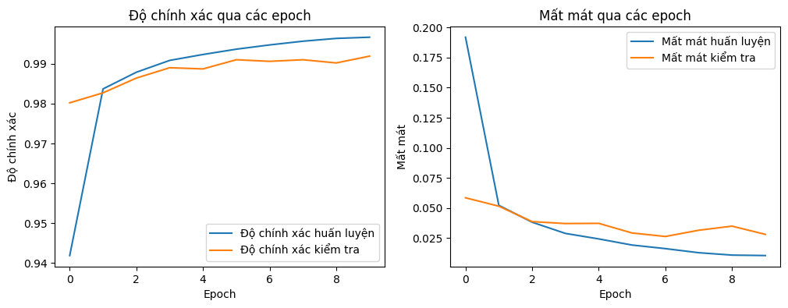
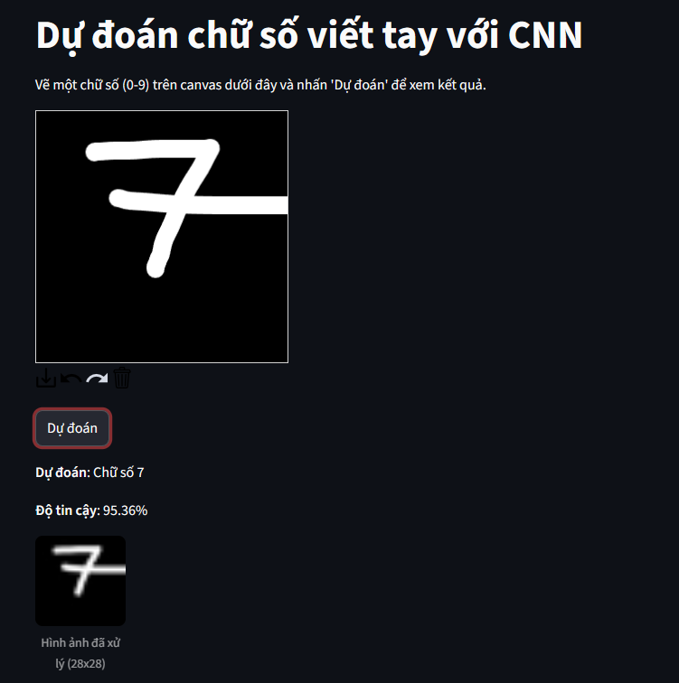

# 🧠 CNN MNIST Classifier

A **Convolutional Neural Network (CNN)** model for handwritten digit recognition using the MNIST dataset.


---
    
## 📋 Project Description

This project builds a CNN model to classify handwritten digits (0-9) with high accuracy on the MNIST dataset, which contains 70,000 images.

---

## 🛠️ Technologies Used

| Technology | Description |
|------------|-------------|
| **TensorFlow 2.x** | Main Deep Learning framework |
| **Keras** | High-level API for building models |
| **NumPy** | Array processing and numerical computation |
| **Matplotlib** | Data and results visualization |
| **Google Colab** | Training environment with free GPU |

---

## 🏗️ Model Architecture

```
Input (28x28x1)
       │
       ▼
┌─────────────────────────────┐
│ Conv2D (32 filters, 3x3)    │
│ Activation: ReLU            │
└─────────────────────────────┘
       │
       ▼
┌─────────────────────────────┐
│ MaxPooling2D (2x2)          │
└─────────────────────────────┘
       │
       ▼
┌─────────────────────────────┐
│ Conv2D (64 filters, 3x3)    │
│ Activation: ReLU            │
└─────────────────────────────┘
       │
       ▼
┌─────────────────────────────┐
│ MaxPooling2D (2x2)          │
└─────────────────────────────┘
       │
       ▼
┌─────────────────────────────┐
│ Conv2D (64 filters, 3x3)    │
│ Activation: ReLU            │
└─────────────────────────────┘
       │
       ▼
┌─────────────────────────────┐
│ Flatten                     │
└─────────────────────────────┘
       │
       ▼
┌─────────────────────────────┐
│ Dense (64 units)            │
│ Activation: ReLU            │
└─────────────────────────────┘
       │
       ▼
┌─────────────────────────────┐
│ Dense (10 units)            │
│ Activation: Softmax         │
└─────────────────────────────┘
       │
       ▼
   Output (10 classes)
```

---

## 📊 Results

| Metric | Value |
|--------|-------|
| **Training Accuracy** | ~99% |
| **Test Accuracy** | ~99% |
| **Epochs** | 10 |
| **Batch Size** | 64 |

### 📈 Accuracy & Loss Charts



---

## 🎯 Demo



---

## 🚀 Getting Started

### Prerequisites

```bash
pip install tensorflow numpy matplotlib
```

### Installation

```bash
# Clone the repository
git clone https://github.com/netprtony/CNN_MNIST.git

# Navigate to project directory
cd CNN_MNIST

# Run the notebook
jupyter notebook CNN_Classifier.ipynb
```

---

## 📁 Project Structure

```
CNN_MNIST/
│
├── 📓 CNN_Classifier.ipynb    # Main notebook
├── 🧠 mnist_cnn_model.h5      # Trained model
├── 📊 image.png               # Accuracy & Loss charts
├── 🎯 image-1.png             # Demo image
└── 📄 README.md               # Project documentation
```

---

## 💡 Skills Demonstrated

| Skill | Description |
|-------|-------------|
| ✅ **Deep Learning** | Building CNN models from scratch |
| ✅ **Image Preprocessing** | Data normalization and reshaping |
| ✅ **Model Training** | Training and validation with TensorFlow/Keras |
| ✅ **Data Visualization** | Plotting results with Matplotlib |
| ✅ **Model Persistence** | Saving and loading trained models |

---

## 📧 Contact

<p align="center">
  <a href="mailto:your-email@example.com"></a>
  <a href="https://linkedin.com/in/your-profile"></a>
  <a href="https://github.com/your-username"></a>
</p>

---

<p align="center">
  ⭐ <strong>If you find this project useful, please give it a star!</strong> ⭐
</p>